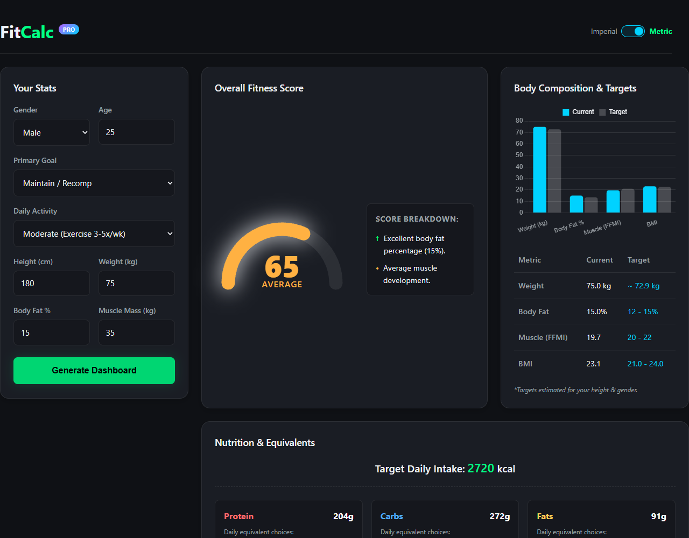

# FitCalc 2.0 - Advanced Fitness Dashboard

FitCalc 2.0 is a modern, responsive web application designed to help users calculate, visualize, and track their fitness metrics. Built with vanilla web technologies, it provides a comprehensive dashboard for body composition analysis, nutrition planning, and exercise strategy.



## Features

### 📊 Core Calculations

- **TDEE & BMR Calculation**: Uses the Mifflin-St Jeor equation to estimate daily energy expenditure.
- **Body Composition Analysis**: Calculates Body Fat Percentage, Lean Mass, and Fat Mass.
- **Goal Setting**: Supports three primary goals: Fat Loss, Maintenance/Recomp, and Muscle Building.
- **Unit Conversion**: Seamless toggle between Metric (kg/cm) and Imperial (lbs/ft) units.

### 📈 Visualizations

- **Overall Fitness Score**: A dynamic gauge chart that rates your fitness level based on body fat and BMI.
- **BMI Scatter Plot**: A 2D chart plotting BMI against Body Fat % with color-coded health zones (Underweight, Healthy, Overweight, Obese).
- **Interactive Charts**: Powered by Chart.js for visualizing current vs. target metrics.

### 🥗 Nutrition & Planning

- **Macro Breakdown**: Detailed daily macronutrient targets (Protein, Carbs, Fats) tailored to your goal.
- **Food Equivalents**: Visual references for portion sizes (e.g., "4 Chicken Breasts", "2 Avocados").
- **Meal Plan**: A 3-day rotating meal plan suggestion based on calculated caloric needs.
- **Exercise Strategy**: Customized workout recommendations based on activity level and goals.

### 💾 Persistence

- **Local Storage**: Automatically saves your stats and preferences so you don't lose progress on refresh.

## Tech Stack

- **HTML5**: Semantic markup for accessibility and structure.
- **CSS3**: Modern styling with BEM methodology, CSS Variables (Custom Properties), Flexbox, and Grid.
- **JavaScript (ES6+)**: Vanilla JS for logic, DOM manipulation, and state management.
- **Chart.js**: For rendering the BMI scatter plot and body composition charts.
- **Tooling**:
  - `serve`: For local development.
  - `prettier`: For code formatting.

## Getting Started

1.  **Clone the repository:**

    ```bash
    git clone https://github.com/your-username/vibe-FitCalc.git
    cd vibe-FitCalc
    ```

2.  **Install dependencies:**

    ```bash
    npm install
    ```

3.  **Run the development server:**
    ```bash
    npm run dev
    ```
    Open your browser to `http://localhost:3000` (or the port shown in the terminal).

## Project Structure

```
vibe-FitCalc/
├── index.html          # Main application structure
├── style.css           # Global styles and responsive design
├── app.js              # Core logic, calculations, and chart rendering
├── screenshot.png      # Latest dashboard preview
└── package.json        # Project dependencies and scripts
```

## Contributing

1.  Fork the repository.
2.  Create your feature branch (`git checkout -b feature/AmazingFeature`).
3.  Commit your changes (`git commit -m 'Add some AmazingFeature'`).
4.  Push to the branch (`git push origin feature/AmazingFeature`).
5.  Open a Pull Request.

## License

This project is licensed under the ISC License.
